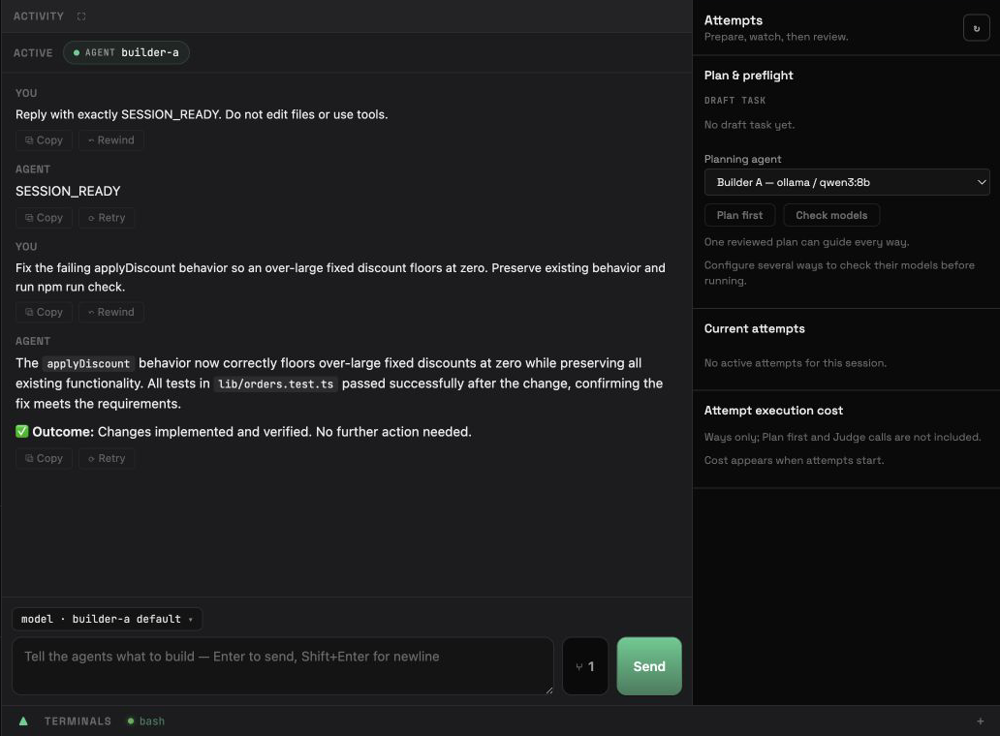
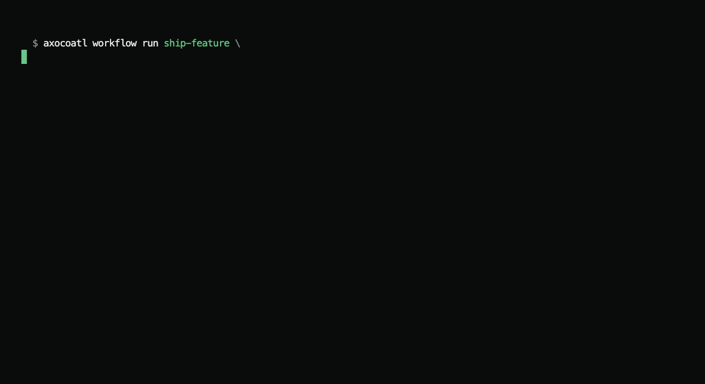
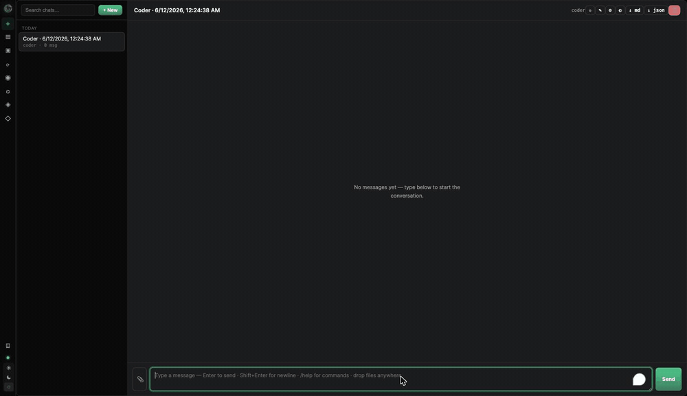
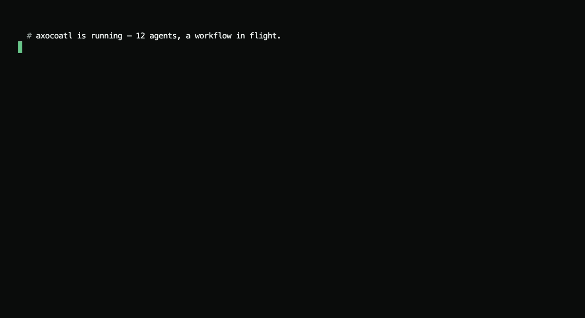

# Axocoatl

**A local-first coding workbench for running, comparing, and keeping agent work.**

[](https://github.com/axocoatl/axocoatl/actions/workflows/ci.yml)
[](https://crates.io/crates/axocoatl-cli)
[](LICENSE)

<p align="center">
  
</p>

<p align="center"><em>A real session after a verified coding attempt was kept. Chat remains the spine; planning, model choice, attempts, and cost stay visible beside it.</em></p>

Axocoatl gives you one folder-anchored session where agents work against a real
repository. Ask for one solution or explore several ways with different agents and
models. Watch what each attempt does, run the repository's checks, compare outcome and
route, keep one, and review the resulting git changes.

The workbench is backed by a Rust runtime with persistent actors, memory,
checkpointing, sandboxed tools, provider-neutral LLM access, explicit Automation
DAGs, and a typed event lattice shared by Skills, triggers, webhooks, and API
observers.

---

## Quickstart

```bash
# 1. Install (no Rust toolchain required)
curl -fsSL https://raw.githubusercontent.com/axocoatl/axocoatl/main/scripts/install.sh | sh

# 2. Interactive setup wizard — picks a provider, scaffolds a project
axocoatl onboard

# 3. Check your environment
axocoatl doctor

# 4. Start the daemon and open the one app
axocoatl dev
# http://localhost:8080
```

Prefer Cargo? `cargo install axocoatl-cli` (requires Rust 1.82+).

> **Skipping `onboard`?** Copy [`axocoatl.example.yaml`](axocoatl.example.yaml)
> to `axocoatl.yaml` for a small starter config. The full `axocoatl.yaml`
> shipped in the repo is a larger populated demo with interval triggers,
> Skills, and MCP servers.

---

## One session, several ways

Most agent tooling gives you one opaque answer or a framework you still have to turn
into a product. Axocoatl gives you the work surface and the runtime underneath it:

- **Chat stays the spine.** Files, editor, terminal, browser, activity, attempts,
  comparison, git, and agent graph open around one persistent session.
- **Attempts are real and heterogeneous.** Choose a different agent and model for each
  way, then inspect the work rather than trusting a single answer. The current attempt
  boundary requires a single-agent session on local Podman.
- **Repository truth stays visible.** Run project checks, compare outcomes and routes,
  keep one result, and review it through git.
- **The runtime survives.** Actors, four-tier memory, checkpointing, and supervision
  preserve work beyond a single request or process lifetime.
- **The execution boundary is yours.** Rootless Podman is the local default; an
  E2B-compatible remote sandbox is an explicit per-session choice.
- **No provider lock-in.** Ollama, OpenAI, OpenRouter, Anthropic, Gemini, Mistral, and
  OpenAI-compatible endpoints can coexist.

Legacy `workflows:` YAML remains a first-boot seed for manual records in the
canonical Automation store. Its `depends_on` declarations become explicit graph
edges; the workflow CLI compatibility command runs that Automation DAG:

```yaml
agents:
  - id: researcher
    provider: ollama
    model: llama3.2
    depends_on: []
  - id: summarizer
    provider: ollama
    model: llama3.2
    depends_on: [researcher]   # becomes an explicit dependency edge

workflows:
  - id: research-and-summarize
    agents: [researcher, summarizer]
    entry_point: researcher
```

```bash
axocoatl workflow run research-and-summarize -i "What is photosynthesis?"
```

---

## See it work

The clips in this section demonstrate runtime behaviors in an earlier interface;
they are not captures of the current session-centered workbench.

**Give it a goal — it builds the team.** A coordinator agent decomposes the goal
into subtasks, spawns a worker to fit each one, and runs them in parallel. No
orchestration code, no glue.

<p align="center"></p>

**Tell it once — it remembers.** Store a preference, open a brand-new
conversation, and it still knows. Agent-editable core memory that persists
across runs.

<p align="center"></p>

**It does not phone home.** There is no Axocoatl telemetry, analytics account, or
vendor control plane collecting your work. Outbound traffic is the traffic you choose:
your model provider, a one-time embedding-model download, optional integrations, and an
optional remote sandbox. Use a local model and set `sandbox.network: none` when
session tools must have no outbound network path.

<p align="center"></p>

---

## Core concepts

- **Workspace** — an authorized project directory that groups persistent sessions.
- **Session** — one durable work item and chat anchored to a workspace.
- **Attempt** — a candidate solution, optionally run in parallel with different
  agents and models, verified and resolved to one kept result.
- **Agents** — persistent `ractor` actors with a provider, tools, 4-tier
  memory, and a token budget. Survive restarts via checkpointing.
- **Hybrid memory recall** — relevant past exchanges are injected each turn, and
  the agent can also pull on demand: `recall_search` (semantic search over past
  sessions) and `recall_timeframe` (read a day's activity log). Tunable per agent.
- **Agent-managed core memory** — editable blocks (`persona`, `human`, `project`,
  …) the agent curates via tools and that render into its prompt each turn (the
  MemGPT/Letta model). Per-agent by default, shareable across agents. A
  background "sleep-time" pass consolidates idle agents' memory automatically.
- **Event lattice** — Skills and runtime components publish typed events;
  Automation triggers, webhooks, and retained API/WebSocket observers consume
  the shared notification feed. The coordination crate also exposes signal
  primitives for library users.
- **Coordinator role** — for explicit hierarchical work, an agent with
  `role: coordinator` decomposes a goal into subtasks (HTN or LLM), auctions them
  to worker agents, runs them in parallel, and synthesizes the results. The pass
  is resumable via checkpointing.
- **Workflow compatibility** — workflow commands and routes project manual
  Automation records; legacy YAML seeds those records only on first boot.
- **Automations** — explicit DAGs created, inspected, edited, and run in
  Settings, with the HTTP API available for programmatic CRUD. New records start
  with a valid Input → Agent graph. They can fire manually, on a fixed interval, by
  lattice event type, or by one Skill. The persisted Automation store is live in
  both `dev` and `serve`; legacy YAML is first-boot seed data only. A top-level
  Interrupt parked at an operator decision survives a daemon restart and resumes
  without replaying completed nodes; arbitrary in-flight calls and nested
  Subgraph Interrupts do not have that recovery guarantee.
- **Providers** — Ollama, OpenAI, Anthropic, Mistral, Gemini, OpenRouter. No lock-in.
- **Protocols** — MCP (discover, call, and expose tools — agents invoke external
  MCP tools through the daemon over a persistent connection) and A2A (agent interop).

See [`docs/PRODUCT.md`](docs/PRODUCT.md) for the product model, the
[docs site](https://docs.axocoatl.ai) for the full guide, the
[marketing site](https://axocoatl.ai) for the positioning, or
[`docs/ARCHITECTURE.md`](docs/ARCHITECTURE.md) and
[`docs/TROUBLESHOOTING.md`](docs/TROUBLESHOOTING.md) for the in-repo
quick reference.

---

## Selected CLI commands

Run `axocoatl --help` and `axocoatl <subcommand> --help` for the authoritative
surface of the installed version.

```
axocoatl onboard                 Interactive setup wizard
axocoatl doctor                  Environment / dependency health check
axocoatl init <name>             Scaffold a project non-interactively
axocoatl validate <config>       Validate a config file
axocoatl dev | serve             Run daemon (+ IPC) / production server
axocoatl chat -a <agent>         Interactive chat
axocoatl workflow list | run     Compatibility view/run for manual Automations
axocoatl agents list|status|restart
axocoatl tokens report           Per-agent token usage
axocoatl mcp servers|tools       Inspect connected MCP servers/tools
```

## Selected HTTP endpoints

This is a quick integration sketch, not an exhaustive route reference. See the
[HTTP API overview](https://docs.axocoatl.ai/api/http/) and current server
router for the full surface.

```
GET  /health                          POST /api/agents/{id}/execute
GET  /api/agents                       GET  /api/agents/{id}/status
POST /api/agents/{id}/restart          GET  /api/tokens/report
GET  /api/workflows                    POST /api/workflows/{id}/execute
GET  /api/mcp/servers                  GET  /api/mcp/tools
GET  /ws   (WebSocket streaming)
```

## Examples

Every example is runnable with a mock LLM — **no API keys needed** — unless
noted. See [`examples/`](examples/).

**Coordination & planning**
- [`stigmergic-workflow`](examples/stigmergic-workflow) — a standalone harness for the reusable `EventLattice` signal primitives plus a `depends_on` DAG; this is not the daemon's Automation executor.
- [`skills-lattice`](examples/skills-lattice) — a standalone demonstration of an example-owned `reacts_to` index and lattice fan-out. In the product daemon, Skills publish events and Automations provide reachable reactions.
- [`htn-planner`](examples/htn-planner) — symbolic HTN decomposition; compound tasks expand via methods and only unresolved frontiers reach the LLM.
- [`crash-recovery`](examples/crash-recovery) — kill a multi-step workflow mid-run and resume from the checkpoint; completed steps are not re-run.

**Memory & providers**
- [`memory-recall`](examples/memory-recall) — agent-managed core memory, semantic recall, and sleep-time consolidation (Tiers 3–4); runs offline.
- [`multi-provider`](examples/multi-provider) — per-agent provider selection: a cheap local model for simple steps, a frontier model for the hard one, with a per-tier cost breakdown.

**Tools, protocols & integration**
- [`tool-hooks`](examples/tool-hooks) — pre/post tool hooks that deny a path-traversal write, audit every call as JSON, and let the agent recover.
- [`mcp-bridge`](examples/mcp-bridge) — call an external MCP tool over stdio through the real `McpToolRegistry`; plus how to expose agents as an MCP server.
- [`a2a-server`](examples/a2a-server) — expose an agent over the A2A protocol (agent card + task endpoint) and call it from a client, in-process.
- [`sandbox-session`](examples/sandbox-session) — the rootless Podman sandbox for agent tool execution: threat model, config knobs, and a live integration test (needs Podman).

**Autonomy & config**
- [`proactive-agents`](examples/proactive-agents) — legacy YAML projected into canonical scheduled and event-triggered Automations, plus an offline guard demonstration.
- [`configs/`](examples/configs) — a gallery of minimal YAML configs for common recipes (research pipeline, feature dev, incident response, local-only, MCP, event webhooks). No Rust.

**Foundations**
- [`research-assistant`](examples/research-assistant), [`code-reviewer`](examples/code-reviewer), [`customer-support`](examples/customer-support) — agent coordination, token budgets, and session/checkpoint memory.

## Build from source

```bash
git clone https://github.com/axocoatl/axocoatl
cd axocoatl
cargo build -p axocoatl-cli --release  # binary: target/release/axocoatl
cargo test --workspace
```

## License

Apache-2.0 — see [LICENSE](LICENSE). Changes: [CHANGELOG.md](CHANGELOG.md).
