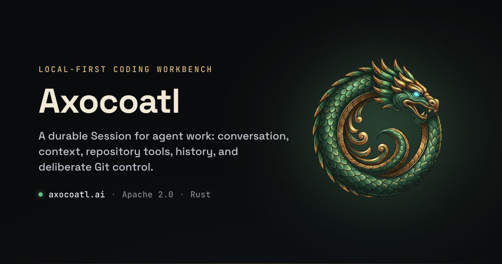

# Axocoatl

**The open-source, local-first workbench for coding agents.**

[](https://github.com/axocoatl/axocoatl/actions/workflows/ci.yml)
[](https://crates.io/crates/axocoatl-cli)
[](LICENSE)

<p align="center">
  
</p>

<p align="center"><em>A durable Session for agent work: conversation, context, repository tools, history, and deliberate Git control.</em></p>

Axocoatl gives you one folder-anchored session where agents work against a real
repository. Use the Agent or configured team that fits the work through files, terminal,
Preview, tools, and Git. When the implementation is genuinely uncertain, explore several
ways with different agents and models, compare outcome and route, and keep one result.

The workbench is backed by a Rust runtime with persistent actors, memory,
checkpointing, sandboxed repository file and shell tools, provider-neutral LLM access, explicit Automation
DAGs, and a typed event lattice shared by Skills, triggers, webhooks, and API
observers.

---

## Quickstart

```bash
# 1. Install (no Rust toolchain required)
curl -fsSL https://raw.githubusercontent.com/axocoatl/axocoatl/main/scripts/install.sh | sh

# 2. Interactive setup wizard — picks a provider, scaffolds a project
axocoatl onboard

# 3. Check your environment
axocoatl doctor

# 4. Start the daemon and open the one app
axocoatl dev
# http://localhost:8080
```

Prebuilt releases support macOS 11 or newer and GNU/Linux with glibc 2.35 or
newer on x86_64 and ARM64. Windows runs through WSL2; there is no native Windows
binary.

Prefer Cargo? `cargo install axocoatl-cli` (requires Rust 1.88+).

> **Skipping `onboard`?** Copy [`axocoatl.example.yaml`](axocoatl.example.yaml)
> to `axocoatl.yaml` for a small starter config. The full `axocoatl.yaml`
> shipped in the repo is a larger populated demo with interval triggers,
> Skills, and MCP servers.

---

## One durable workbench

Axocoatl joins the repository work surface to the runtime underneath it:

- **Conversation stays the spine.** Files/editor/Source Control, Preview, attempt review,
  and agent graph open as focused tools from the Session header or **More**; the contextual
  Ways inspector appears only while needed, and Terminal remains in its bottom dock.
- **Session history is durable and usable.** Accepted turns have stable identities and
  explicit running, completed, failed, cancelled, or interrupted state. Reopen the
  session to read them, run case-insensitive text search in this session or all sessions,
  export Markdown or JSON, or, in an autonomous single-Agent Session, rewind the visible
  history at a turn boundary.
- **Context belongs to the Session.** Attach a bounded file for the next normal turn or
  retain it for later turns in that Session. Remove it to stop future selection; a historical
  relation and blob pin remain so earlier turns can still open their exact context. There is no
  separate cross-chat Files destination.
- **Stop addresses the exact turn.** A stale Stop cannot cancel whichever work happens
  to be visible. Cancellation is cooperative: provider streaming stops promptly, while
  an already-started side-effecting tool is allowed to reach a safe boundary.
- **Attempts are real and heterogeneous.** Choose a different agent and model for each
  way, then inspect the work rather than trusting a single answer. While the Ways decision
  is unresolved, lifecycle, output, Route, failure, usage, cost, and optional Judge evidence
  rehydrate. Before Checks, changed paths and diffs are live-runtime evidence; after a restart
  they remain unavailable until Checks protects the candidate identity. Completed Check
  evidence then survives reload. The current attempt boundary requires a single
  autonomous-Agent Session on local Podman. Ways use each Way's configured primary
  provider/model directly; rate-limit fallback remains on the ordinary Session path until a
  Way can persist and price its effective fallback route honestly.
- **Repository truth stays visible.** Keep records the selected output and turn attribution
  in durable Session History, applies its changes without committing, and cleans up the
  attempt set. Candidate Routes, diffs, Checks, Judge ranking, and cost are not copied into
  durable Session History. **Last turn** filters the current Git diff to paths attributed to the
  latest durable turn; it is not a frozen per-turn diff.
- **The runtime survives.** Supervised actors and checkpoints preserve model-facing
  continuity beyond one request. Autonomous Agents and declared coordinator Workers own
  scoped four-tier memory; a Coordinator owns Tier-1 conversation plus live orchestration
  checkpoints within the non-terminal run boundary.
- **The execution boundary is yours.** Rootless Podman is the local default; an
  E2B Cloud remote sandbox and its template are explicit daemon-wide
  configuration. The backend targets E2B Cloud; third-party E2B API
  implementations are outside the 1.0 support scope. E2B rejects a per-Session
  OCI image rather than silently substituting its template. Closing a Ready E2B
  Session pauses and preserves its exact remote working tree; reopening reconnects to that
  runtime. Failed or interrupted preparation is cleaned up instead. Deleting the Session or
  changing its runtime is the destructive boundary.
- **Control-plane state stays outside repository tools.** On supported Unix hosts,
  the daemon retains its opened data-directory authority and rejects link-based
  redirection of managed state. Local Podman masks the data and lease roots if either
  sits below the Workspace, and rejects a Workspace at or beneath those roots. A
  compatibility preflight cleans up only provably exposing, non-current reserved-name
  containers before Session state is recovered.
- **Repository setup is reviewed.** Detected setup such as `npm ci` is shown as
  an exact, unchecked proposal. Conversation Send, Files, Source Control,
  Terminal, Preview, Agent tools, and Ways actions that start work or inspect
  a live checkout remain unavailable until the environment is durably Ready.
  Durable History and the exact Keep/Discard recovery path remain reachable.
  An operator may default only the exact devcontainer post-create command for
  an unreviewed Session; a reviewed checked or unchecked choice wins, and
  edited or lockfile-detected commands are outside that default.
- **Readiness fails honestly.** The exact curated references—Alpine 3.20,
  Debian bookworm slim, Ubuntu 24.04, Python 3.12 slim, Node 20 slim, and Rust
  bookworm—are accepted without arbitrary-image trust, then local Podman
  verifies the repository commands Axocoatl requires.
  It may provision those commands inside the container, but it never installs
  Podman or creates its VM; missing host prerequisites remain explicit. A root
  Node project gets a Session-owned Linux `node_modules` volume, so the host's
  native dependency tree is masked rather than executed in the container.
- **No provider lock-in.** Axocoatl supports six provider IDs: Ollama, OpenAI, OpenRouter,
  Anthropic, Gemini, and Mistral. The `openai` adapter targets either OpenAI or one
  OpenAI-compatible endpoint.

Legacy `workflows:` YAML remains a first-boot seed for manual records in the
canonical Automation store. Its `depends_on` declarations become explicit graph
edges; the workflow CLI compatibility command runs that Automation DAG:

```yaml
agents:
  - id: researcher
    provider: ollama
    model: llama3.2
    depends_on: []
  - id: summarizer
    provider: ollama
    model: llama3.2
    depends_on: [researcher]   # becomes an explicit dependency edge

workflows:
  - id: research-and-summarize
    agents: [researcher, summarizer]
    entry_point: researcher
```

```bash
axocoatl workflow run research-and-summarize -i "What is photosynthesis?"
```

---

## See it work

The clips in this section demonstrate runtime behaviors in an earlier interface;
they are not captures of the current session-centered workbench.

**Give it a goal — it builds the team.** A coordinator agent decomposes the goal
into subtasks, spawns a worker to fit each one, and runs them in parallel. No
orchestration code, no glue.

<p align="center"></p>

**Tell it once — the Session remembers.** Store a preference with an autonomous Agent,
continue that durable Session after another turn or actor restart, and it still knows. A
declared coordinator Worker has the same Session-scoped memory stack. A core block explicitly
marked `shared: true` can carry selected knowledge across Agent and Session scopes.

<p align="center"></p>

**It does not phone home.** There is no Axocoatl telemetry, analytics account, or
vendor control plane collecting your work. Outbound paths include your configured
model provider, the one-time Hugging Face embedding-model download, optional daemon-side
integrations, the optional remote sandbox, and repository, image, or package traffic allowed
by Podman's default bridge. Use a local model and set `sandbox.network: none` to block
outbound traffic from repository code and commands inside local Podman. That setting does
not block daemon-side providers, MCP, web search, webhooks, the remote sandbox, the embedding
download, or Podman image-registry access. E2B cannot prove that container network policy and
rejects the combination.

<p align="center"></p>

---

## Core concepts

- **Workspace** — a persistent, user-named identity for one authorized project directory.
- **Session** — one durable work item and conversation created inside a Workspace.
- **Session turn** — one accepted request, its immutable context references, outputs,
  and final lifecycle state in the Session's canonical history. Actor checkpoints remain a
  separate execution-recovery cache.
- **Attempt** — a candidate solution, optionally run in parallel with different
  agents and models, verified and resolved to one kept result.
- **Agents** — configured templates for a provider, model, tools, memory policy, role, and
  token budget. An autonomous Agent is instantiated under each normal Session's durable
  Tier 1–4 identity. A Coordinator owns scoped Tier-1 conversation plus orchestration
  checkpointing; its declared Workers own scoped Tier 1–4 identities beneath it. The global
  compatibility actor remains separate, and ad-hoc Workers are run-scoped and ephemeral.
- **Hybrid memory recall** — relevant past exchanges are injected each turn, and
  the Agent can also pull on demand: `recall_search` (semantic search within that
  Agent instance's scope) and `recall_timeframe` (read its dated activity log). Tunable
  for autonomous Agents and declared Workers, retained across actor restart in the same
  Session. The Coordinator provider loop itself does not expose Tier 2–4 recall in 1.0.
- **Agent-managed core memory** — editable blocks (`persona`, `human`, `project`,
  …) the agent curates via tools and that render into its prompt each turn (the
  MemGPT/Letta model). Available to autonomous Agents and declared Workers, scoped to their
  Session runtime identity by default; only blocks marked `shared: true` cross Agent or
  Session scopes. A
  configured background "sleep-time" pass consolidates registered idle autonomous
  Agents' memory. Declared Coordinator Workers are not polled by that loop.
- **Event lattice** — Skills and runtime components publish typed events;
  Automation triggers, webhooks, and retained API/WebSocket observers consume
  the shared notification feed. The coordination crate also exposes signal
  primitives for library users.
- **Coordinator role** — for explicit hierarchical work, an agent with
  `role: coordinator` decomposes a goal into subtasks (HTN or LLM), auctions them
  to worker agents, runs them in parallel, and synthesizes the results. Internal
  checkpoints protect the live orchestration boundary. Once a Session turn is
  Completed, Cancelled, Failed, or Interrupted, a later turn decomposes fresh rather
  than silently resuming that terminal work.
- **Workflow compatibility** — workflow commands and routes project manual
  Automation records; legacy YAML seeds those records only on first boot.
- **Automations** — explicit DAGs created, inspected, edited, and run in
  Settings, with the HTTP API available for programmatic CRUD. New records start
  with a valid Input → Agent graph. They can fire manually, on a fixed interval, by
  lattice event type, or by one Skill. The persisted Automation store is live in
  both `dev` and `serve`; legacy YAML is first-boot seed data only. A top-level
  Interrupt parked at an operator decision survives a daemon restart and resumes
  without replaying completed nodes; arbitrary in-flight calls and nested
  Subgraph Interrupts do not have that recovery guarantee.
- **Providers** — Ollama, OpenAI, Anthropic, Mistral, Gemini, OpenRouter. No lock-in.
- **Protocols** — MCP (discover, call, and expose tools — agents invoke external
  MCP tools through the daemon over a persistent connection) and inbound A2A task dispatch.

See [`docs/PRODUCT.md`](docs/PRODUCT.md) for the product model, the
[docs site](https://docs.axocoatl.ai) for the full guide, the
[marketing site](https://axocoatl.ai) for the positioning, or
[`docs/ARCHITECTURE.md`](docs/ARCHITECTURE.md) and
[`docs/TROUBLESHOOTING.md`](docs/TROUBLESHOOTING.md) for the in-repo
quick reference.

---

## Selected CLI commands

Run `axocoatl --help` and `axocoatl <subcommand> --help` for the authoritative
surface of the installed version.

```
axocoatl onboard                 Interactive setup wizard
axocoatl doctor                  Environment / dependency health check
axocoatl init <name>             Scaffold a project non-interactively
axocoatl validate <config>       Validate a config file
axocoatl dev | serve             Run daemon (+ IPC) / production server
axocoatl chat -a <agent>         Interactive chat
axocoatl workflow list | run     Compatibility view/run for manual Automations
axocoatl agents list|status|restart
axocoatl tokens report           Per-agent token usage
axocoatl mcp servers|tools       Inspect connected MCP servers/tools
```

## Selected HTTP endpoints

This is a quick integration sketch, not an exhaustive route reference. See the
[HTTP API overview](https://docs.axocoatl.ai/reference/http-api/) and current server
router for the full surface.

```
GET  /health                          POST /api/agents/{id}/execute
GET  /api/agents                       GET  /api/agents/{id}/status
POST /api/agents/{id}/restart          GET  /api/tokens/report
GET  /api/workflows                    POST /api/workflows/{id}/execute
GET  /api/mcp/servers                  GET  /api/mcp/tools
GET  /api/workspaces                   POST /api/workspaces
GET  /api/workspaces/{id}/sessions     POST /api/workspaces/{id}/sessions
GET  /api/sessions/{id}/turns          GET  /api/session-turns/search?q=...
GET  /api/sessions/{id}/export         POST /api/sessions/{id}/rewind
GET  /api/sessions/{id}/attachments    POST /api/sessions/{id}/attachments
GET  /ws   (WebSocket streaming)
```

The retained lightweight Chat and global FileStore routes are compatibility APIs for
integrations. They do not restore directoryless Chat or cross-chat Files as browser
destinations; the app keeps conversation history and attached context inside a Session.

## Examples

Every example is runnable with a mock LLM — **no API keys needed** — unless
noted. See [`examples/`](examples/).

**Coordination & planning**
- [`stigmergic-workflow`](examples/stigmergic-workflow) — a standalone harness for the reusable `EventLattice` signal primitives plus a `depends_on` DAG; this is not the daemon's Automation executor.
- [`skills-lattice`](examples/skills-lattice) — a standalone demonstration of an example-owned `reacts_to` index and lattice fan-out. In the product daemon, Skills publish events and Automations provide reachable reactions.
- [`htn-planner`](examples/htn-planner) — symbolic HTN decomposition; compound tasks expand via methods and only unresolved frontiers reach the LLM.
- [`crash-recovery`](examples/crash-recovery) — a standalone example-owned behavior that resumes a multi-step workflow checkpoint without re-running completed steps; this is not the normal Session Coordinator terminal-recovery contract.

**Memory & providers**
- [`memory-recall`](examples/memory-recall) — agent-managed core memory, semantic recall, and sleep-time consolidation (Tiers 3–4); runs offline.
- [`multi-provider`](examples/multi-provider) — per-agent provider selection: a cheap local model for simple steps, a frontier model for the hard one, with a per-tier cost breakdown.

**Tools, protocols & integration**
- [`tool-hooks`](examples/tool-hooks) — pre/post tool hooks that deny a path-traversal write, audit every call as JSON, and let the agent recover.
- [`mcp-bridge`](examples/mcp-bridge) — call an external MCP tool over stdio through the real `McpToolRegistry`; plus how to expose agents as an MCP server.
- [`a2a-server`](examples/a2a-server) — expose an agent over the A2A protocol (agent card + task endpoint) and call it from a client, in-process.
- [`sandbox-session`](examples/sandbox-session) — the rootless Podman sandbox for agent tool execution: threat model, config knobs, and a live integration test (needs Podman).

**Autonomy & config**
- [`proactive-agents`](examples/proactive-agents) — legacy YAML projected into canonical scheduled and event-triggered Automations, plus an offline guard demonstration.
- [`configs/`](examples/configs) — a gallery of minimal YAML configs for common recipes (research pipeline, feature dev, incident response, local-only, MCP, event webhooks). No Rust.

**Foundations**
- [`research-assistant`](examples/research-assistant), [`code-reviewer`](examples/code-reviewer), [`customer-support`](examples/customer-support) — agent coordination, token budgets, and session/checkpoint memory.

## Build from source

```bash
git clone https://github.com/axocoatl/axocoatl
cd axocoatl
cargo build -p axocoatl-cli --release  # binary: target/release/axocoatl
cargo test --workspace
```

## License

Apache-2.0 — see [LICENSE](LICENSE). Changes: [CHANGELOG.md](CHANGELOG.md).
