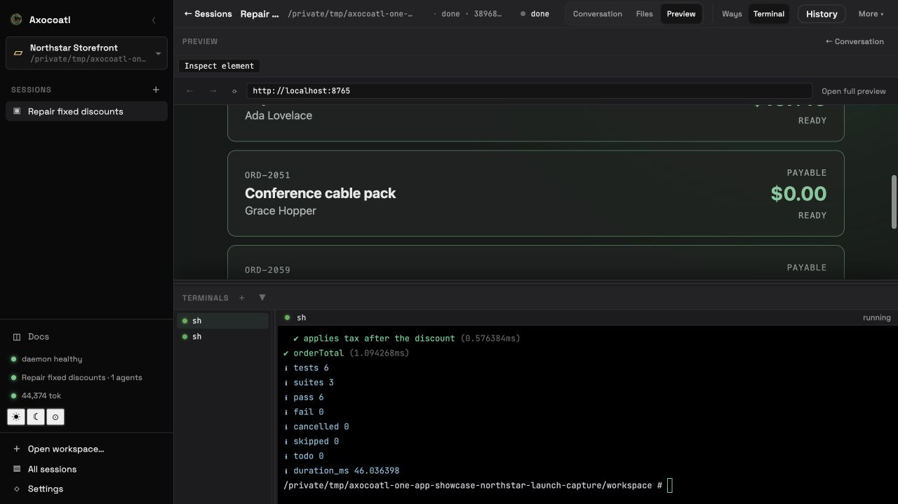
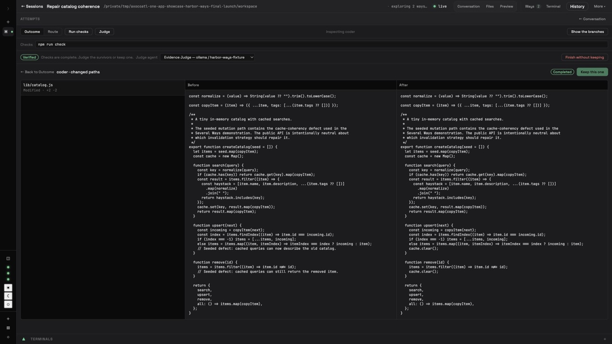
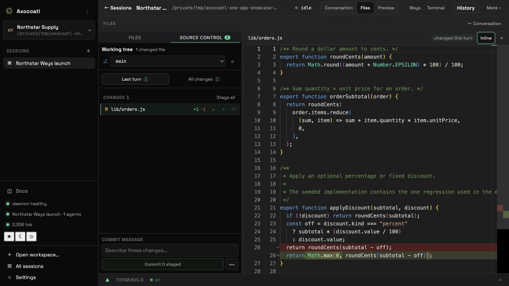

# Axocoatl

**The open-source, local-first workbench for coding agents.**

[](https://github.com/axocoatl/axocoatl/actions/workflows/ci.yml)
[](https://crates.io/crates/axocoatl-cli)
[](LICENSE)

<p align="center">
  
</p>

<p align="center"><strong>Agent work you can inspect, compare, and keep.</strong></p>

Axocoatl v1 gives coding agents one durable, folder-anchored Session for real
repository work. Conversation, Files, Terminal, Preview, tools, History, and Git
stay together. Use one configured Agent or team for the direct path. When the
implementation is genuinely uncertain, run the same task several Ways with
different agents and models, compare the evidence, and Keep one result as
uncommitted Git changes.

Install one `axocoatl` executable and use the workbench in your existing browser.
The CLI, Rust daemon, HTTP/WebSocket API, and workbench browser assets ship together,
so using Axocoatl requires no separate frontend install or bundled browser runtime.
Rootless Podman remains the required local backend for sandboxed Workspace Sessions.

Under the workbench, persistent actors, scoped memory, canonical Session History,
checkpointing, sandboxed tools, Automations, MCP, A2A, and provider-neutral model
access keep the work durable and extensible.

---

## Quickstart

```bash
# 1. Install (no Rust toolchain required)
curl -fsSL https://axocoatl.ai/install.sh | sh

# 2. Configure Axocoatl for this OS user
axocoatl onboard

# 3. Check your environment
axocoatl doctor

# 4. Start the daemon and open the one app
axocoatl dev
# http://localhost:8080
# Choose Open workspace… in the app to authorize a repository.
```

Prebuilt releases support macOS 11 or newer and GNU/Linux with glibc 2.35 or
newer on x86_64 and ARM64. Windows runs through WSL2; there is no native Windows
binary.

Prefer Cargo? `cargo install axocoatl-cli` (requires Rust 1.88+).

`axocoatl onboard` creates no project, repository, Workspace, or Session. It
writes one owner-only user configuration and platform data directory. Repositories
become Workspaces only when you authorize them through **Open workspace…**.

> **Advanced project-local configuration:** `axocoatl init <name>` scaffolds an
> explicit local `axocoatl.yaml`. Pass it with `--config`; Axocoatl never selects
> a repository's configuration merely because it is the current directory.

---

## From request to reviewed change

1. Open or resume a Workspace Session.
2. Ask one Agent for a solution, or turn on **Explore several ways** and choose
   an Agent and model for each attempt.
3. Compare Outcome and Route, inspect changed paths and diffs, then run Checks
   and an optional Judge.
4. Choose **Keep this one** to apply one candidate to the primary checkout
   without committing it.
5. Open **Last turn** in Source Control, review the current attributed diff,
   stage what you want, and commit deliberately.

## One workbench, from request to review

- **One executable, one browser surface.** `axocoatl dev` starts the local daemon
  and serves the embedded workbench at `http://localhost:8080`. Conversation stays
  central while Files, Source Control, Preview, Terminal, History, and focused review
  open around the active Session.
- **The Session survives the process.** Accepted turns have stable identities and
  explicit running, completed, failed, cancelled, or interrupted states. Reopen a
  Session, search its History, export Markdown or JSON, and keep bounded context tied
  to the work it informed.
- **Explore several ways before you choose.** Give the same request and repository
  snapshot to different Agent/model pairs. Each attempt gets an independent checkout
  and sandbox. Compare Outcome and Route, inspect changed paths and diffs, run Checks
  and an optional Judge, and see usage and known cost before you Keep one.
- **Keep is a Git decision, not an automatic commit.** **Keep this one** applies the
  selected candidate to the primary checkout, records its output and turn attribution
  in durable Session History, and removes the unresolved attempt set. **Last turn**
  filters the current Git diff to paths attributed to that turn so you can review,
  stage, and commit deliberately.
- **Execution and providers remain your choice.** Rootless Podman is the local
  default; E2B Cloud is an explicit remote option for normal Session work. Axocoatl
  supports Ollama, OpenAI, OpenRouter, Anthropic, Gemini, Mistral, and one
  OpenAI-compatible endpoint.

## What the v1 contract covers

- **Durable turn identity and lifecycle.** Axocoatl records a request and immutable
  context references before execution. Exact Stop targets one active turn; cooperative
  cancellation lets an already-started side-effecting tool reach a safe boundary.
- **Reviewed repository setup.** Detected setup such as `npm ci` is an exact,
  unchecked proposal, not consent. Repository tools remain unavailable until the
  Session environment is durably Ready. Axocoatl can provision required commands in
  an approved sandbox, but it does not install Podman or create its VM.
- **Honest Ways recovery.** Unresolved lifecycle, output, Route, failure, usage, cost,
  optional Judge, and protected Check evidence rehydrate. Before Checks protects a
  candidate identity, a restart cannot restore its live changed-path or diff evidence.
  In v1, Ways requires an autonomous single-Agent Session on local Podman; attachments,
  Skills, MCP tools, and web search are withheld from candidate attempts.
- **An explicit post-Keep boundary.** The kept task, output, and turn attribution join
  canonical Session History. Candidate Routes, diffs, Checks, Judge ranking, and
  cost do not. **Last turn** is a filter over the current working tree, not a frozen
  per-turn patch.
- **Local-first, not an offline guarantee.** Axocoatl adds no product telemetry,
  hosted control plane, or Axocoatl account. Configured providers, MCP servers, web
  search, webhooks, E2B Cloud, Podman image or package downloads, repository traffic,
  and the embedding-model download can use the network.

The exact storage, isolation, setup, recovery, and network contracts are documented
in [`docs/PRODUCT.md`](docs/PRODUCT.md), [`docs/ARCHITECTURE.md`](docs/ARCHITECTURE.md),
and [the security guide](https://docs.axocoatl.ai/operate/security/).

---

## See v1 work

**One Session, with the repository around it.**

[](https://axocoatl.ai/assets/films/session-workbench.mp4)

**Several Ways, compared on evidence.**

[](https://axocoatl.ai/assets/films/several-ways.mp4)

**One kept result, returned to normal Git review.**

[](https://axocoatl.ai/assets/films/git-last-turn.mp4)

---

## Core concepts

- **Workspace** — a persistent, user-named identity for one authorized project directory.
- **Session** — one durable work item and conversation created inside a Workspace.
- **Session turn** — one accepted request, its immutable context references, outputs,
  and final lifecycle state in the Session's canonical history. Actor checkpoints remain a
  separate execution-recovery cache.
- **Attempt** — a candidate solution, optionally run in parallel with different
  agents and models, verified and resolved to one kept result.
- **Agents** — configured templates for a provider, model, tools, memory policy, role, and
  token budget. An autonomous Agent is instantiated under each normal Session's durable
  Tier 1–4 identity. A Coordinator owns scoped Tier-1 conversation plus orchestration
  checkpointing; its declared Workers own scoped Tier 1–4 identities beneath it. The global
  compatibility actor remains separate, and ad-hoc Workers are run-scoped and ephemeral.
- **Hybrid memory recall** — relevant past exchanges are injected each turn, and
  the Agent can also pull on demand: `recall_search` (semantic search within that
  Agent instance's scope) and `recall_timeframe` (read its dated activity log). Tunable
  for autonomous Agents and declared Workers, retained across actor restart in the same
  Session. The Coordinator provider loop itself does not expose Tier 2–4 recall in 1.0.
- **Agent-managed core memory** — editable blocks (`persona`, `human`, `project`,
  …) the agent curates via tools and that render into its prompt each turn (the
  MemGPT/Letta model). Available to autonomous Agents and declared Workers, scoped to their
  Session runtime identity by default; only blocks marked `shared: true` cross Agent or
  Session scopes. A
  configured background "sleep-time" pass consolidates registered idle autonomous
  Agents' memory. Declared Coordinator Workers are not polled by that loop.
- **Event lattice** — Skills and runtime components publish typed events;
  Automation triggers, webhooks, and retained API/WebSocket observers consume
  the shared notification feed. The coordination crate also exposes signal
  primitives for library users.
- **Coordinator role** — for explicit hierarchical work, an agent with
  `role: coordinator` decomposes a goal into subtasks (HTN or LLM), auctions them
  to worker agents, runs them in parallel, and synthesizes the results. Internal
  checkpoints protect the live orchestration boundary. Once a Session turn is
  Completed, Cancelled, Failed, or Interrupted, a later turn decomposes fresh rather
  than silently resuming that terminal work.
- **Workflow compatibility** — workflow commands and routes project manual
  Automation records; legacy YAML seeds those records only on first boot.
- **Automations** — explicit DAGs created, inspected, edited, and run in
  Settings, with the HTTP API available for programmatic CRUD. New records start
  with a valid Input → Agent graph. They can fire manually, on a fixed interval, by
  lattice event type, or by one Skill. The persisted Automation store is live in
  both `dev` and `serve`; legacy YAML is first-boot seed data only. A top-level
  Interrupt parked at an operator decision survives a daemon restart and resumes
  without replaying completed nodes; arbitrary in-flight calls and nested
  Subgraph Interrupts do not have that recovery guarantee.
- **Providers** — Ollama, OpenAI, Anthropic, Mistral, Gemini, OpenRouter. No lock-in.
- **Protocols** — MCP (discover, call, and expose tools — agents invoke external
  MCP tools through the daemon over a persistent connection) and inbound A2A task dispatch.

See [`docs/PRODUCT.md`](docs/PRODUCT.md) for the product model, the
[docs site](https://docs.axocoatl.ai) for the full guide, the
[marketing site](https://axocoatl.ai) for the positioning, or
[`docs/ARCHITECTURE.md`](docs/ARCHITECTURE.md) and
[`docs/TROUBLESHOOTING.md`](docs/TROUBLESHOOTING.md) for the in-repo
quick reference.

---

## Selected CLI commands

Run `axocoatl --help` and `axocoatl <subcommand> --help` for the authoritative
surface of the installed version.

```
axocoatl onboard                 Configure Axocoatl for this OS user
axocoatl doctor                  Environment / dependency health check
axocoatl init <name>             Scaffold an explicit project-local config
axocoatl validate <config>       Validate a config file
axocoatl dev | serve             Run daemon (+ IPC) / production server
axocoatl chat -a <agent>         Interactive chat
axocoatl workflow list | run     Compatibility view/run for manual Automations
axocoatl agents list|status|restart
axocoatl tokens report           Per-agent token usage
axocoatl mcp servers|tools       Inspect connected MCP servers/tools
```

## Selected HTTP endpoints

This is a quick integration sketch, not an exhaustive route reference. See the
[HTTP API overview](https://docs.axocoatl.ai/reference/http-api/) and current server
router for the full surface.

```
GET  /health                          POST /api/agents/{id}/execute
GET  /api/agents                       GET  /api/agents/{id}/status
POST /api/agents/{id}/restart          GET  /api/tokens/report
GET  /api/workflows                    POST /api/workflows/{id}/execute
GET  /api/mcp/servers                  GET  /api/mcp/tools
GET  /api/workspaces                   POST /api/workspaces
GET  /api/workspaces/{id}/sessions     POST /api/workspaces/{id}/sessions
GET  /api/sessions/{id}/turns          GET  /api/session-turns/search?q=...
GET  /api/sessions/{id}/export         POST /api/sessions/{id}/rewind
GET  /api/sessions/{id}/attachments    POST /api/sessions/{id}/attachments
GET  /ws   (WebSocket streaming)
```

The retained lightweight Chat and global FileStore routes are compatibility APIs for
integrations. They do not restore directoryless Chat or cross-chat Files as browser
destinations; the app keeps conversation history and attached context inside a Session.

## Examples

Every example is runnable with a mock LLM — **no API keys needed** — unless
noted. See [`examples/`](examples/).

**Coordination & planning**
- [`stigmergic-workflow`](examples/stigmergic-workflow) — a standalone harness for the reusable `EventLattice` signal primitives plus a `depends_on` DAG; this is not the daemon's Automation executor.
- [`skills-lattice`](examples/skills-lattice) — a standalone demonstration of an example-owned `reacts_to` index and lattice fan-out. In the product daemon, Skills publish events and Automations provide reachable reactions.
- [`htn-planner`](examples/htn-planner) — symbolic HTN decomposition; compound tasks expand via methods and only unresolved frontiers reach the LLM.
- [`crash-recovery`](examples/crash-recovery) — a standalone example-owned behavior that resumes a multi-step workflow checkpoint without re-running completed steps; this is not the normal Session Coordinator terminal-recovery contract.

**Memory & providers**
- [`memory-recall`](examples/memory-recall) — agent-managed core memory, semantic recall, and sleep-time consolidation (Tiers 3–4); runs offline.
- [`multi-provider`](examples/multi-provider) — per-agent provider selection: a cheap local model for simple steps, a frontier model for the hard one, with a per-tier cost breakdown.

**Tools, protocols & integration**
- [`tool-hooks`](examples/tool-hooks) — pre/post tool hooks that deny a path-traversal write, audit every call as JSON, and let the agent recover.
- [`mcp-bridge`](examples/mcp-bridge) — call an external MCP tool over stdio through the real `McpToolRegistry`; plus how to expose agents as an MCP server.
- [`a2a-server`](examples/a2a-server) — expose an agent over the A2A protocol (agent card + task endpoint) and call it from a client, in-process.
- [`sandbox-session`](examples/sandbox-session) — the rootless Podman sandbox for agent tool execution: threat model, config knobs, and a live integration test (needs Podman).

**Autonomy & config**
- [`proactive-agents`](examples/proactive-agents) — legacy YAML projected into canonical scheduled and event-triggered Automations, plus an offline guard demonstration.
- [`configs/`](examples/configs) — a gallery of minimal YAML configs for common recipes (research pipeline, feature dev, incident response, local-only, MCP, event webhooks). No Rust.

**Foundations**
- [`research-assistant`](examples/research-assistant), [`code-reviewer`](examples/code-reviewer), [`customer-support`](examples/customer-support) — agent coordination, token budgets, and session/checkpoint memory.

## Build from source

```bash
git clone https://github.com/axocoatl/axocoatl
cd axocoatl
cargo build -p axocoatl-cli --release  # binary: target/release/axocoatl
cargo test --workspace
```

## License

Apache-2.0 — see [LICENSE](LICENSE). Changes: [CHANGELOG.md](CHANGELOG.md).
