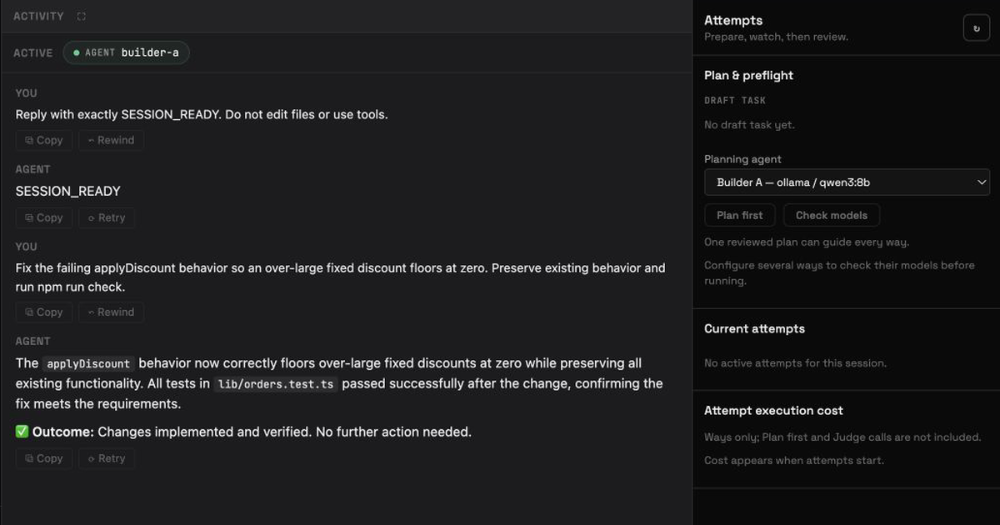

# Axocoatl

**The harness you can trust to run coding agents on your own machine or infrastructure.**

Isolation built in. A complete record of every step. Any model, local or hosted.

[](https://github.com/axocoatl/axocoatl/actions/workflows/ci.yml)
[](https://crates.io/crates/axocoatl-cli)
[](LICENSE)

<p align="center">
  
</p>

Axocoatl runs coding agents against your repository. It is one open-source Rust
executable: a daemon that runs the Agents and records their work, and a web
workbench you open in your browser. The default is one Agent, the Lead, which
writes; read-only helpers it can delegate to, and checks and a review the host
runs before a turn completes, are opt-in.

### Isolation built in

- **Every Session's tools run in a sandbox.** A rootless Podman container on your
  machine by default; E2B Cloud is an explicit remote option on the compatibility
  path. Network access is on by default; set `sandbox.network: none` for
  repositories you don't trust.
- **Read-only helpers cannot write or connect out.** They get no file-writing
  tools, and the kernel blocks their shell from changing the repository or opening
  TCP connections (Landlock, Linux 6.7 or later). Otherwise they get no shell.
- **Per-Agent write scopes in one checkout.** An Agent's file tools refuse paths
  outside its scope, and every change it made is checked against complete,
  digest-verified snapshots of the repository from before and after its work. For
  an Agent with a shell, that check is review evidence, not confinement.

### A complete record

- **The host runs your checks.** Required checks run after the Agents finish, on
  the exact final files; a required review is run by the host with a read-only
  reviewer, and requested changes go back to the Lead for a bounded number of rounds.
- **Budgets you approve.** Every Agent runs under limits you set. A model call is
  charged what it actually used once the provider reports it, and grants and budgets
  carry across restarts.
- **Every step is kept.** The Session durably records every model call, tool call,
  budget decision and check, next to the conversation, Files, Terminal, Preview and Git.

### Any model, per Agent

- **Each Agent has its own provider and model.** Local models through Ollama,
  hosted models through OpenRouter, with budgets enforced on both. Adapters for
  Anthropic, OpenAI, Gemini and Mistral are included on the compatibility path.
- **Small local models are a first-class target.** An Ollama stream that ends early
  is retried once, older tool output is replaced by a short placeholder in later
  requests, and a request that would overflow a small context window is trimmed
  instead of failing.

Axocoatl adds no product telemetry and needs no Axocoatl account.

## What we measured

<!-- measured: axocoatl-1.1.0 2026-10-01 -->
A pre-registered benchmark: 6 Python maintenance tasks frozen on 2026-09-22, scored by
25 withheld tests the agents never see. The writer is qwen3-coder 30B running locally;
one run per task, temperature 0.

**Through Axocoatl 1.1.0:**

| Setup | Withheld tests passed | Tokens vs. one pass |
| --- | --- | --- |
| One Agent, one pass | 17 / 25 | 1× |
| The same writer with a Required review by a stronger local model (gpt-oss 120B) | **19 / 25** | 2.6× |

The reviewer reported 15 defects and 14 were real. The writer applied every finding it
received, including the one false alarm, which cost a test; 6 real findings came in the
second and last review round, after which Axocoatl stops revising.

**Where extra tokens help** (same tasks, a plain agent loop without Axocoatl):

| Setup | Withheld tests passed | Tokens vs. one pass |
| --- | --- | --- |
| The same Agent reviews its own work | 17 / 25 | 3.5× |
| A fresh reviewer on the same model (it approved every change) | 17 / 25 | 2.3× |
| The same model writes its own tests (4 of 6 tasks run) | one more test | 9–15× |
| A stronger reviewer (gpt-oss 120B) | 20 / 25 | 3.3× |
<!-- /measured -->

Extra tokens helped when they bought a stronger model's judgment, not more looks
from the same model. Axocoatl lets each Agent use its own model, so a local writer
can be reviewed by a stronger model, and the host still runs your checks and records
every step. We do not claim the default team beats a single Agent; one Agent remains
the cheaper choice for small tasks. Details and limits:
[What we measured](https://docs.axocoatl.ai/understand/what-we-measured/).

---

## Quickstart

The execution contracts below describe the 1.1.0 source tree. The installer and
`cargo install` select published releases; see the [changelog](CHANGELOG.md)
for versioned changes.

```bash
# 1. Install (no Rust toolchain required)
curl -fsSL https://axocoatl.ai/install.sh | sh

# 2. Configure Axocoatl for this OS user
axocoatl onboard

# 3. Check your environment
axocoatl doctor

# 4. Start the daemon and open the one app
axocoatl dev
# Open the "Sign in:" link it prints (http://localhost:8080/?token=…).
# `axocoatl url` prints it again.
# Choose Open workspace… in the app to authorize a repository.
```

Prebuilt releases support macOS 11 or newer and GNU/Linux with glibc 2.35 or
newer on x86_64 and ARM64. Windows runs through WSL2; there is no native Windows
binary.

Prefer Cargo? `cargo install axocoatl-cli` (requires Rust 1.88+).

Cargo and source builds compile the host application and include Axocoatl's prebuilt
Linux process supervisor inside the same executable. It needs no separate installation
or startup download. Its source and [explicit rebuild procedure](docs/EXEC_SUPERVISOR_BUILD.md)
are included in this repository.

`axocoatl onboard` creates no project, repository, Workspace, or Session. It
writes one owner-only user configuration and platform data directory. Repositories
become Workspaces only when you authorize them through **Open workspace…**.

The configuration defines a default team: **Lead**, which owns the change and
edits files, and **Scout** and **Reviewer**, read-only helpers Lead can delegate a
question or a review to. A new Session starts with one Agent, Lead: in **Team &
budget** you enter its limits and choose **Apply** before the first request. The
helpers and a required review are opt-in there; select **Let this Agent delegate to
helpers** to add Scout and Reviewer and enter their limits too. Helpers cost extra
tokens, and one Agent is cheaper for small tasks. To change the team, see
[Default team](https://docs.axocoatl.ai/understand/coordination/#default-team).

> **Advanced project-local configuration:** `axocoatl init <name>` scaffolds an
> explicit local `axocoatl.yaml`. Pass it with `--config`; Axocoatl never selects
> a repository's configuration merely because it is the current directory.

---

## From request to reviewed change

1. Open or resume a Workspace Session.
2. In **Team & budget**, enter the limits for Lead and its helpers, and add any
   required checks or a required reviewer. Choose **Apply** before the first Send.
3. Ask for the change. Lead reads and edits the repository and delegates
   questions or a review to its helpers. The Agent graph shows each helper it
   started and what it returned.
4. If the team has required checks, the host runs them after the Agents finish;
   a required reviewer then reads the result, and requested changes go back to
   Lead for another round. The turn completes only when both pass; otherwise it
   needs attention and says why.
5. When an implementation decision needs independent evidence, turn on
   **Explore several ways** instead, compare Outcome and Route, run Checks and an
   optional Judge, and choose **Keep this one**.
6. Open **Last turn** in Source Control, review the current attributed diff,
   stage what you want, and commit deliberately.

## What else the workbench does

- **One executable, one browser surface.** `axocoatl dev` starts the local daemon
  and serves the embedded workbench at `http://localhost:8080`, behind a
  per-daemon sign-in token. Conversation stays
  central while Files, Source Control, Preview, Terminal, History, and focused review
  open around the active Session.
- **The Session survives the process.** Accepted turns have stable identities and
  explicit running, completed, failed, cancelled, or interrupted states. Reopen a
  Session, search its History, export Markdown or JSON, and keep bounded context tied
  to the work it informed.
- **Knowledge carries into the next Session.** Keep versioned Markdown decisions,
  conventions, and findings in the Workspace. Open **Knowledge** to inspect their
  sources, backlinks, proposals, and graph, or attach an exact note revision to chat.
  Native Agents can retrieve notes and propose updates; accepted publication remains
  separate from speculative work. A bounded code map exposes observed definitions
  and imports, with source changes and unavailable evidence kept visible.
- **Every activation stays inspectable.** Native turns bind each Agent activation
  to an immutable definition, input, conversation, and approved budget. The Agent
  graph shows generations, output, usage, and causal evidence, including a
  "delegated" edge from a lead to each helper, with missing details labeled.
  **Team & budget** reviews future turns; current-turn controls act on exact
  recorded generations. A lead delegates only to helper templates you approved,
  within limits reserved from its own grant.
- **Explore several ways before you choose.** Give the same request and repository
  snapshot to different Agent/model pairs. Each attempt gets an independent checkout
  and sandbox. Compare Outcome and Route, inspect changed paths and diffs, run Checks
  and an optional Judge, and see usage and known cost before you Keep one.
- **Keep is a Git decision, not an automatic commit.** **Keep this one** applies the
  selected candidate to the primary checkout, records its output and turn attribution
  in durable Session History, and removes the unresolved runtime set. Native Ways also
  retain the bounded candidate comparison and human decision after cleanup, including
  decisions that keep nothing. Set explicit History storage limits before starting Ways.
  **Last turn**
  filters the current Git diff to paths attributed to that turn so you can review,
  stage, and commit deliberately.
- **Execution and providers remain your choice.** Rootless Podman is the local
  default. Native repository tools and checks require its process supervisor;
  E2B Cloud remains an explicit remote option on the compatibility path. Provider
  adapters include Ollama, OpenAI, OpenRouter, Anthropic, Gemini, Mistral, and one
  OpenAI-compatible endpoint, subject to the execution contracts below.

## Execution contracts

New data roots use the native Session controller. **Team & budget** requires explicit
limits and expiry before execution. Its enforced provider boundary currently supports
reviewed local Ollama profiles and eligible OpenRouter text/tool endpoints paid with
OpenRouter credits. OpenRouter requires `providers.openrouter_billing: credits`, a
normal API key, and an account with no connected BYOK provider keys. BYOK is not
supported. A compatible HTTP API alone does not establish a bound.
The onboarding wizard offers Ollama and OpenRouter for native Sessions. For Ollama it
checks that the server is a loopback Ollama 0.20.6 with its cloud features disabled
(`OLLAMA_NO_CLOUD=1`, or `{"disable_ollama_cloud": true}` in `~/.ollama/server.json`),
and suggests Lead and Reviewer models from those installed on it; `axocoatl doctor`
reports the same requirements.
Direct OpenAI and Anthropic configurations remain available through manual YAML
on their supported compatibility paths.
The other configured provider adapters remain available through their supported legacy
and compatibility paths. Existing legacy roots are not silently converted. After
stopping the daemon and making a cold backup, use `axocoatl session upgrade --confirm`
to convert the existing data. History and usage remain; historical Agent state whose
role was not recorded stays archived instead of becoming future model context.

### Recovery and compatibility boundaries

- **Durable turn identity and lifecycle.** Axocoatl records a request and immutable
  context references before execution. Exact Stop targets one active turn; cooperative
  cancellation lets an already-started side-effecting tool reach a safe boundary.
- **Reviewed repository setup.** Detected setup such as `npm ci` is an exact,
  unchecked proposal, not consent. Repository tools remain unavailable until the
  Session environment is durably Ready. Axocoatl can provision required commands in
  an approved sandbox, but it does not install Podman or create its VM.
- **Legacy Ways recovery.** Unresolved lifecycle, output, Route, failure, usage, cost,
  optional Judge, and protected Check evidence rehydrate. Before Checks protects a
  candidate identity, a restart cannot restore its live changed-path or diff evidence.
  In v1, Ways requires an autonomous single-Agent Session on local Podman; attachments,
  Skills, MCP tools, and web search are withheld from candidate attempts.
- **Legacy post-Keep history.** The kept task, output, and turn attribution join
  canonical Session History. Candidate Routes, diffs, Checks, Judge ranking, and
  cost do not. **Last turn** is a filter over the current working tree, not a frozen
  per-turn patch.
- **Local-first, not an offline guarantee.** Axocoatl adds no product telemetry,
  hosted control plane, or Axocoatl account. Configured providers, MCP servers, web
  search, webhooks, E2B Cloud, Podman image or package downloads, repository traffic,
  and the embedding-model download can use the network.

The exact storage, isolation, setup, recovery, and network contracts are documented
in [`docs/PRODUCT.md`](docs/PRODUCT.md), [`docs/ARCHITECTURE.md`](docs/ARCHITECTURE.md),
and [the security guide](https://docs.axocoatl.ai/operate/security/).

---

## Workspace knowledge

The Knowledge inspector shares accepted notes across Sessions in one Workspace.
Notes retain their revision, origin, source hashes, and typed links. Edit them in
the workbench or explicitly import/export Markdown for another editor; no vault is silently added
to your repository. Native requests retain a bounded selection of relevant note
revisions with their origin and source applicability. Search and the cached code
map help an Agent choose what to read next.

Each Session retains its own source index, which parses Rust, JavaScript, TypeScript, TSX, and Python definitions
and import syntax. It is a bounded observed index, not a complete reference or call
graph. Refresh it after source changes and inspect the current files before relying
on a remembered explanation. A changed hash signals that its evidence needs review.

Model proposals do not become accepted knowledge just because a tool call finished.
Publication checks accepted activation state and expected note revisions. For an
isolated Way, automatic publication also requires its exact retained Keep decision;
other candidates stay pending for explicit human review. Human edits and conflicts
remain explicit. **Investigate in chat** attaches a selected
note and prepares a follow-up request under ordinary Session authority and budgets.
Read [Workspace knowledge](https://docs.axocoatl.ai/workbench/knowledge/).

## Core concepts

- **Workspace** — a persistent, user-named identity for one authorized project directory.
- **Session** — one durable work item and conversation created inside a Workspace.
- **Session turn** — one accepted request, its immutable context references, outputs,
  and final lifecycle state in the Session's canonical history. Actor checkpoints remain a
  separate execution-recovery cache.
- **Attempt** — a candidate solution, optionally run in parallel with different
  agents and models, verified and resolved to one kept result.
- **Lead and helpers** — in a native Session, an Agent whose Team & budget approval
  names helper templates gets a `delegate` tool. Each call starts one read-only helper
  in an empty conversation, reserves its limits from the lead's grant, and returns
  its answer to the lead. A helper that could change files is refused.
- **Grant** — the limits you approve in Team & budget for an Agent: activations,
  invocations, tokens, cost, and expiry. Every provider and tool call is reserved
  against it before it runs; raising a limit takes a human decision.
- **Required checks and required review** — optional completion conditions for a
  native team. Checks are commands the host runs between two captures of the
  repository; review is a read-only reviewer the host runs, in a fresh conversation,
  for 1 to 3 rounds. A turn completes only when every condition passes on the exact
  final tree.
- **Agents** — configured templates for a provider, model, tools, memory policy, role, and
  token budget. Native activations retain exact input, accepted conversation checkpoints,
  and usage; their execution path does not attach Tier 2–4 memory stores. On the legacy
  path, an autonomous Agent has a Session-scoped Tier 1–4 identity. A Coordinator owns
  scoped Tier-1 conversation plus orchestration checkpointing; its declared Workers
  own scoped Tier 1–4 identities beneath it. The global
  compatibility actor remains separate, and ad-hoc Workers are run-scoped and ephemeral.
- **Legacy hybrid memory recall** — relevant past exchanges are injected each turn, and
  the Agent can also pull on demand: `recall_search` (semantic search within that
  Agent instance's scope) and `recall_timeframe` (read its dated activity log). Tunable
  for autonomous Agents and declared Workers, retained across actor restart in the same
  Session. The Coordinator provider loop itself does not expose Tier 2–4 recall in 1.0.
- **Legacy agent-managed core memory** — editable blocks (`persona`, `human`, `project`,
  …) the agent curates via tools and that render into its prompt each turn (the
  MemGPT/Letta model). Available to autonomous Agents and declared Workers, scoped to their
  Session runtime identity by default; only blocks marked `shared: true` cross Agent or
  Session scopes. A
  configured background "sleep-time" pass consolidates registered idle autonomous
  Agents' memory. Declared Coordinator Workers are not polled by that loop.
  Legacy Lattice, Custom, and Coordinator turns can read these stores, but cannot
  write them or run core-memory consolidation during the turn.
- **Event feed** — firing a Skill publishes each event in its `emits` list;
  Automation triggers, webhooks, and retained API/WebSocket observers consume
  that feed, which keeps no history and starts no Agents on its own. Library
  users get the feed from `axocoatl_core::event_feed`.
- **Coordinator role** — in a native Session, a template with `role: coordinator`
  runs as a lead over its approved Worker templates. On a legacy Session, it
  decomposes a goal into subtasks with its model, assigns each to the first
  declared worker that can call its required tools, runs them in parallel, and
  synthesizes the results; once that turn is Completed, Cancelled, Failed, or
  Interrupted, a later turn decomposes fresh rather than silently resuming it.
  On a 1.0 data root, a Session turn that would run two or more Agents is refused
  until the operator runs `axocoatl session upgrade --confirm`.
- **Workflow compatibility** — workflow commands and routes project manual
  Automation records; legacy YAML seeds those records only on first boot.
- **Automations** — explicit DAGs created, inspected, edited, and run in
  Settings, with the HTTP API available for programmatic CRUD. New records start
  with a valid Input → Agent graph. They can fire manually, on a fixed interval, by
  the name of an event a Skill publishes, or by one Skill. The persisted Automation store is live in
  both `dev` and `serve`; legacy YAML is first-boot seed data only. A top-level
  Interrupt parked at an operator decision survives a daemon restart and resumes
  without replaying completed nodes; arbitrary in-flight calls and nested
  Subgraph Interrupts do not have that recovery guarantee.
- **Providers** — Ollama, OpenAI, Anthropic, Mistral, Gemini, OpenRouter. No lock-in.
- **Protocols** — MCP (discover, call, and expose tools — agents invoke external
  MCP tools through the daemon over a persistent connection) and inbound A2A task dispatch.

See [`docs/PRODUCT.md`](docs/PRODUCT.md) for the product model, the
[docs site](https://docs.axocoatl.ai) for the full guide, the
[marketing site](https://axocoatl.ai) for the positioning, or
[`docs/ARCHITECTURE.md`](docs/ARCHITECTURE.md) and
[`docs/TROUBLESHOOTING.md`](docs/TROUBLESHOOTING.md) for the in-repo
quick reference.

---

## Selected CLI commands

Run `axocoatl --help` and `axocoatl <subcommand> --help` for the authoritative
surface of the installed version.

```
axocoatl onboard                 Configure Axocoatl for this OS user
axocoatl doctor                  Environment / dependency health check
axocoatl init <name>             Scaffold an explicit project-local config
axocoatl validate <config>       Validate a config file
axocoatl dev | serve             Run daemon (+ IPC) / production server
axocoatl url                     Print the browser sign-in link
axocoatl chat -a <agent>         Interactive chat
axocoatl session upgrade --confirm  Convert stopped legacy Session storage after backup
axocoatl workflow list | run     Compatibility view/run for manual Automations
axocoatl agents list|status|restart
axocoatl tokens report           Per-agent token usage
axocoatl mcp servers|tools       Inspect connected MCP servers/tools
```

## Selected HTTP endpoints

This is a quick integration sketch, not an exhaustive route reference. See the
[HTTP API overview](https://docs.axocoatl.ai/reference/http-api/) and current server
router for the full surface. Every route except the health probes and static assets
needs a credential; locally, send `Authorization: Bearer <token>` with the token
from `local-api-token` in the data directory.

```
GET  /health                          POST /api/agents/{id}/execute
GET  /api/agents                       GET  /api/agents/{id}/status
POST /api/agents/{id}/restart          GET  /api/tokens/report
GET  /api/workflows                    POST /api/workflows/{id}/execute
GET  /api/mcp/servers                  GET  /api/mcp/tools
GET  /api/workspaces                   POST /api/workspaces
GET  /api/workspaces/{id}/sessions     POST /api/workspaces/{id}/sessions
GET  /api/sessions/{id}/turns          GET  /api/session-turns/search?q=...
GET  /api/sessions/{id}/export         POST /api/sessions/{id}/rewind
GET  /api/sessions/{id}/attachments    POST /api/sessions/{id}/attachments
GET  /ws   (WebSocket streaming)
```

The retained lightweight Chat and global FileStore routes are compatibility APIs for
integrations. They do not restore directoryless Chat or cross-chat Files as browser
destinations; the app keeps conversation history and attached context inside a Session.

## Examples

Every example is runnable with a mock LLM — **no API keys needed** — unless
noted. See [`examples/`](examples/).

**Recovery**
- [`crash-recovery`](examples/crash-recovery) — a standalone example-owned behavior that resumes a multi-step workflow checkpoint without re-running completed steps; this is not the normal Session Coordinator terminal-recovery contract.

**Memory & providers**
- [`memory-recall`](examples/memory-recall) — agent-managed core memory, semantic recall, and sleep-time consolidation (Tiers 3–4); runs offline.
- [`multi-provider`](examples/multi-provider) — per-agent provider selection: a cheap local model for simple steps, a frontier model for the hard one, with a per-tier cost breakdown.

**Tools, protocols & integration**
- [`tool-hooks`](examples/tool-hooks) — pre/post tool hooks that deny a path-traversal write, audit every call as JSON, and let the agent recover.
- [`mcp-bridge`](examples/mcp-bridge) — call an external MCP tool over stdio through the real `McpToolRegistry`; plus how to expose agents as an MCP server.
- [`a2a-server`](examples/a2a-server) — expose an agent over the A2A protocol (agent card + task endpoint) and call it from a client, in-process.
- [`sandbox-session`](examples/sandbox-session) — the rootless Podman sandbox for agent tool execution: threat model, config knobs, and a live integration test (needs Podman).

**Autonomy & config**
- [`proactive-agents`](examples/proactive-agents) — legacy YAML projected into canonical scheduled and event-triggered Automations, plus an offline guard demonstration.
- [`configs/`](examples/configs) — a gallery of minimal YAML configs for common recipes (research pipeline, feature dev, incident response, local-only, MCP, event webhooks). No Rust.

**Foundations**
- [`research-assistant`](examples/research-assistant), [`code-reviewer`](examples/code-reviewer), [`customer-support`](examples/customer-support) — library-level mock-provider examples: a two-Agent pipeline, a Coordinator that splits a review across Workers, token budgets, and session/checkpoint memory.

## Build from source

```bash
git clone https://github.com/axocoatl/axocoatl
cd axocoatl
cargo build -p axocoatl-cli --release  # binary: target/release/axocoatl
cargo test --workspace
```

## License

Apache-2.0 — see [LICENSE](LICENSE). Changes: [CHANGELOG.md](CHANGELOG.md).
